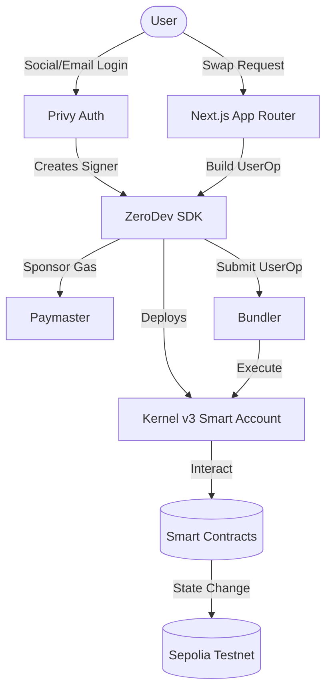

# Token Swap dApp

<div align="center">
    
    
    
    
    
    
    
</div>

<p align="center">
    <i>A gasless token swap decentralized application built with Next.js, Privy, and ZeroDev on Ethereum Sepolia testnet. Experience seamless token swaps without needing ETH for gas fees. Try it!</i>
</p>

## Features

Token Swap offers a complete gasless DeFi experience designed for Web3 newcomers and experienced users alike.

### Core Capabilities

#### 1. Gasless Transactions

Powered by ZeroDev's paymaster system.

- **Zero ETH Required**: Users can swap tokens without holding ETH.
- **Sponsored Gas**: All transaction fees are covered by the paymaster.
- **Seamless UX**: No wallet pop-ups asking for gas approval.

#### 2. Smart Account Integration

Built on ERC-4337 account abstraction.

- **Kernel v3**: Uses ZeroDev's latest smart account implementation.
- **Batched Transactions**: Multiple operations in a single transaction.
- **Social Recovery**: Account recovery options for enhanced security.
- **Session Keys**: Delegated signing for improved UX.

### Token Operations

- **Token Faucet**: Get test tokens (PEPE & USDC) with one click.
- **Token Swap**: Exchange PEPE ↔ USDC at a fixed rate (1 PEPE = 0.000011 USDC).
- **Real-time Balances**: Automatic balance refresh after transactions.

---

## User Dashboard

The swap interface provides a clean, intuitive experience with real-time feedback.

### Dashboard Components

```
┌─────────────────────────────────────────────────────┐
│  ACCOUNT INFO: Smart Account Address               │
│  [PEPE Balance] [USDC Balance] [Get Test Tokens]   │
└─────────────────────────────────────────────────────┘

┌───────────────┬───────────────┬───────────────┬───────────────┐
│  From Token   │  Amount       │  To Token     │  Rate         │
│  PEPE         │  [Input]      │  USDC         │  1:0.000011   │
└───────────────┴───────────────┴───────────────┴───────────────┘
```

### Swap System

#### Exchange Rates

- **PEPE → USDC**: 1 PEPE = 0.000011 USDC
- **USDC → PEPE**: 1 USDC = ~90,909 PEPE

#### Faucet Limits

| Token | Amount per Request | Max Supply |
| ----- | ------------------ | ---------- |
| PEPE  | 9,090,909          | 100M       |
| USDC  | 100                | 100M       |

---

## System Architecture

The application follows a modern serverless architecture with a focus on gasless UX and account abstraction.



## Technology Stack

- **Frontend**: [Next.js 15](https://nextjs.org/) (App Router), [React 19](https://react.dev/), [Tailwind CSS](https://tailwindcss.com/)
- **Authentication**: [Privy](https://privy.io/) (Social login, email, wallet)
- **Account Abstraction**: [ZeroDev SDK](https://zerodev.app/) (Kernel v3, paymaster, bundler)
- **Blockchain Interactions**: [Viem](https://viem.sh/) (TypeScript Ethereum library)
- **Smart Contracts**: [Solidity 0.8.20](https://soliditylang.org/), [Hardhat](https://hardhat.org/), [OpenZeppelin](https://openzeppelin.com/)
- **Network**: [Ethereum Sepolia](https://sepolia.dev/) (Testnet)

## Key Features

### 1. Robust Authentication

- **Hybrid System**: Uses Privy for flexible authentication with email, social, or wallet options.
- **Smart Account Creation**: Automatic Kernel v3 smart account deployment on first login.
- **Context Provider**: React context for seamless smart account state management.

### 2. Gasless Transaction Engine

- **Paymaster Integration**: ZeroDev paymaster sponsors all gas fees.
- **User Operations**: ERC-4337 compliant transaction bundling.
- **Automatic Retry**: Built-in retry logic for failed transactions.

### 3. Smart Contract System

Three core contracts power the swap functionality:

| Contract         | Description                  | Decimals |
| ---------------- | ---------------------------- | -------- |
| MockPEPE         | Test ERC-20 with faucet      | 18       |
| MockUSDC         | USDC-like ERC-20 with faucet | 6        |
| SimpleSwapRouter | Fixed-rate token swap router | N/A      |

### 4. Premium Design System

- **Glassmorphism UI**: Modern, translucent card effects.
- **Responsive Layout**: Mobile-first design approach.
- **Loading States**: Informative modals for transaction status.
- **Real-time Updates**: Automatic balance refresh after operations.

---

## Project Structure

```
token-swap/
├── contracts/              # Smart contracts
│   ├── MockPEPE.sol       # PEPE token (18 decimals)
│   ├── MockUSDC.sol       # USDC token (6 decimals)
│   └── SimpleSwapRouter.sol # Token swap router
├── scripts/               # Deployment scripts
│   ├── deploy-mocks.ts    # Deploy contracts
│   └── add-liquidity.js   # Add router liquidity
├── src/
│   ├── app/              # Next.js app directory
│   ├── components/       # React components
│   │   ├── AccountInfo.tsx      # Account & faucet
│   │   ├── SwapCard.tsx         # Swap interface
│   │   ├── ConnectWallet.tsx    # Auth button
│   │   ├── FaucetModal.tsx      # Faucet status modal
│   │   └── SwapLoadingModal.tsx # Swap status modal
│   ├── context/          # React context
│   │   └── SmartAccountContext.tsx # ZeroDev integration
│   └── lib/              # Utilities
│       └── zerodev.ts    # ZeroDev client setup
└── hardhat.config.ts     # Hardhat configuration
```

---

## Getting Started

### Prerequisites

- Node.js 18+ and npm
- MetaMask or another Web3 wallet (for deployment only)
- Alchemy API key
- Privy App ID
- ZeroDev Project ID

### 1. Clone the Repository

```bash
git clone <repository-url>
cd token-swap
```

### 2. Install Dependencies

```bash
npm install
```

### 3. Environment Setup

Create a `.env.local` file in the root directory:

```env
# Privy Configuration
NEXT_PUBLIC_PRIVY_APP_ID=your_privy_app_id

# ZeroDev Configuration
NEXT_PUBLIC_ZERODEV_PROJECT_ID=your_zerodev_project_id
NEXT_PUBLIC_ZERODEV_BUNDLER_URL=https://rpc.zerodev.app/api/v3/YOUR_PROJECT_ID/chain/11155111
NEXT_PUBLIC_ZERODEV_PAYMASTER_URL=https://rpc.zerodev.app/api/v3/YOUR_PROJECT_ID/chain/11155111?selfFunded=true

# Alchemy Configuration
NEXT_PUBLIC_ALCHEMY_API_KEY=your_alchemy_api_key

# Network Configuration
NEXT_PUBLIC_SEPOLIA_RPC_URL=https://rpc.sepolia.org

# Contract Addresses (will be populated after deployment)
NEXT_PUBLIC_PEPE_ADDRESS=
NEXT_PUBLIC_USDC_ADDRESS=
NEXT_PUBLIC_ROUTER_ADDRESS=

# Deployment (for Hardhat)
PRIVATE_KEY=your_private_key_for_deployment
```

### 4. Deploy Smart Contracts

```bash
# Compile contracts
npx hardhat compile

# Deploy to Sepolia
npx hardhat run scripts/deploy-mocks.ts --network sepolia
```

After deployment, copy the contract addresses to your `.env.local`.

### 5. Add Liquidity to Router

```bash
npx hardhat run scripts/add-liquidity.js --network sepolia
```

This adds initial liquidity (1B PEPE + 1M USDC) to the swap router.

### 6. Run Development Server

```bash
npm run dev
```

Open [http://localhost:3000](http://localhost:3000) in your browser.

---

## Deployed Contracts (Sepolia)

| Contract | Address                                      |
| -------- | -------------------------------------------- |
| PEPE     | `0x0E189C460874370415Fc7eAdb3a00BFB9BaF104a` |
| USDC     | `0x3c37e10d6262c38aC6DD8A8F24C5580d22828DCe` |
| Router   | `0x2efB63030B09CC5152F2F4B54C600d238bbf931E` |

---

## Testing

```bash
# Run Hardhat tests
npx hardhat test

# Run with coverage
npx hardhat coverage
```

---

## Security Considerations

**This is a testnet demo application. DO NOT use in production without:**

- Comprehensive security audits
- Proper access controls
- Rate limiting
- Slippage protection
- Oracle price feeds
- Emergency pause mechanisms

---

## Contributing

Contributions are welcome! Please feel free to submit a Pull Request.

## License

MIT License - see LICENSE file for details

---

<div align="center">
    <p>Built with Next.js, Privy, and ZeroDev</p>
</div>
